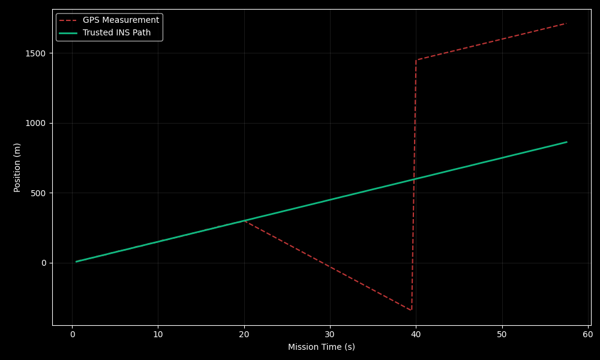

# **MetaSpace Drone Defense: Formal Integrity Layer**

**MetaSpace Drone Shield** is a high-integrity security framework designed to mitigate GPS Spoofing attacks in autonomous UAV systems. By utilizing **Formal Invariants** and **Logic-as-Hardware** synthesis, MetaSpace guarantees detection of spatial divergence within safety-critical latency bounds.

## **🛡️ The Innovation: Deterministic Integrity**

Unlike traditional probabilistic or AI-based models, MetaSpace treats security as a mathematical constraint.

* **Zero-Trust Navigation:** Real-time cross-verification of GPS data against Trusted Inertial Sensors (INS).  
* **Shield Engaged Protocol:** Immediate, deterministic isolation of compromised data streams upon invariant violation.  
* **Logic-as-Hardware:** Specifications compiled directly to FPGA gate-level logic, immune to OS-level exploits.

## **🚀 Quick Start**

### **1\. Installation**

pip install \-r requirements.txt

### **2\. Launch Simulation Server**

Run the tactical simulation to start the telemetry broadcaster:  
python examples/spoofing\_simulation.py

### **3\. Open Mission Control**

Open **index.html** in your browser to access the real-time visual analysis suite.

## **📊 Simulation & Results**

For a detailed analysis of detection performance and the autonomous fallback logic, please refer to:

* [Autonomous Fallback Analysis](https://docs/autonomous_fallback.md)  
* [Technical Architecture](https://docs/architecture.md)

*Figure 1: Real-time detection of a GPS "pull-away" attack. The system triggers a **Shield Engaged** state upon detection.*

## **🧪 About the Project**

Developed by an independent Software Architect at **LemonScript**, the R\&D laboratory of **Citrom Méda LTD**, our work focuses on bridging abstract philosophy with rigorous engineering. The MetaSpace framework ensures every system is mathematically verified and architecturally sound by design.  
**Official Site:** [metaspace.bio](https://biological-code.netlify.app)

## **🤝 Collaboration & Licensing**

This project is licensed under the MIT License \- see the [LICENSE](LICENSE) file for details.  
Proprietary FPGA synthesis engines and Pro Compiler access are managed by **Citrom Méda LTD**.  
For business inquiries or research partnerships, please refer to the [CONTACT.md](CONTACT.md) guide.

*Verified by MetaSpace Pro. Mathematics is the ultimate firewall.*
