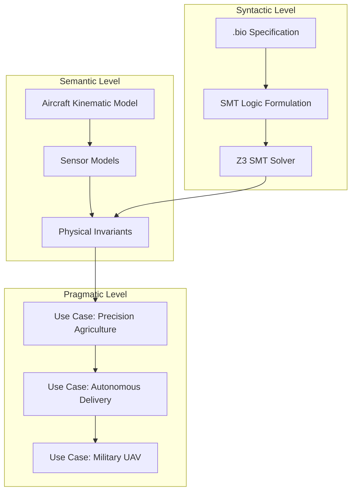
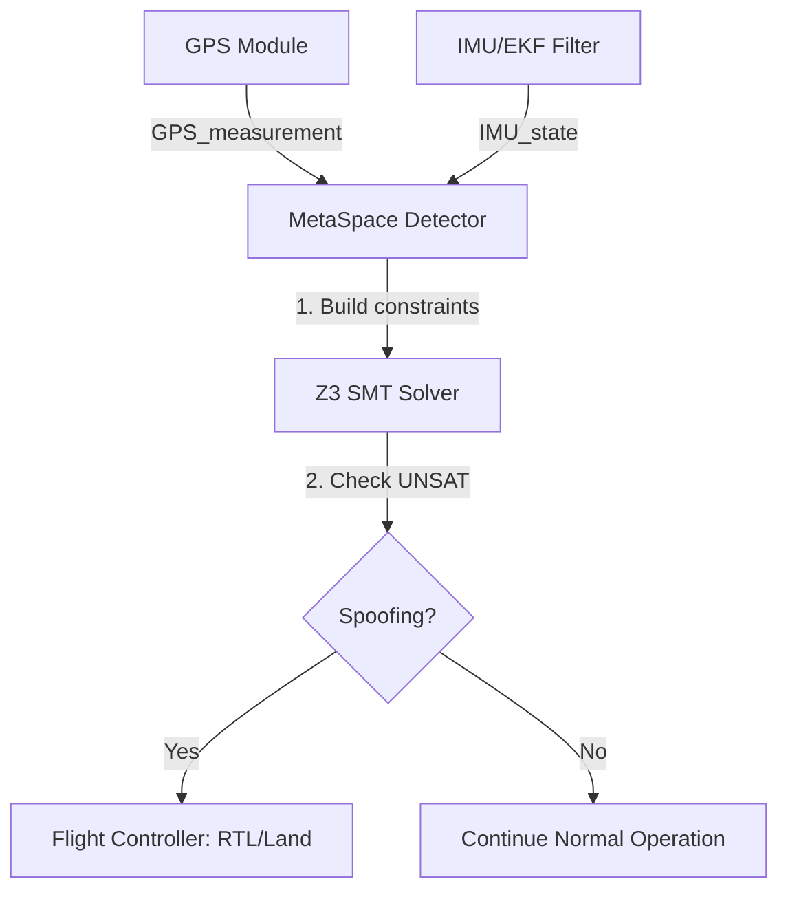

# MetaSpace Architecture: Logical Structure

This document describes the three-level architecture of the MetaSpace GPS spoofing detection system: Syntactic, Semantic, and Pragmatic levels.

## Overview

MetaSpace operates on three distinct levels:

1. **Syntactic Level**: SMT logic formulation and constraint solving
2. **Semantic Level**: Real-world mapping (aircraft models, sensor models)
3. **Pragmatic Level**: Concrete application (use cases, integration)

---

## 1. Syntactic Level (SMT Logic)

### Input: GPS Measurement + IMU Data

```
GPS_measurement = {
  latitude: float,
  longitude: float,
  altitude: float,
  timestamp: float
}

IMU_state = {
  velocity: vec3,
  acceleration: vec3,
  orientation: quaternion,
  angular_velocity: vec3
}
```

### Constraints: Kinematic Invariants

```
constraints(m, τ) := {
  
  KINEMATIC:
  ├─ |a| ≤ a_max(aircraft_type)  [max acceleration]
  ├─ Δpos ≤ v_max · Δt            [max velocity]
  ├─ |α| ≤ α_max(aircraft_type)   [max turn rate]
  │
  SENSOR_CONSISTENCY:
  ├─ |GPS_pos - IMU_pos| ≤ σ_GPS  [position drift]
  ├─ |GPS_vel - IMU_vel| ≤ σ_vel  [velocity drift]
  │
  TEMPORAL:
  ├─ Δt > 0.1s                     [minimum time step]
  └─ Δt < 2.0s                     [maximum gap]
}
```

### Output: SMT Solve Result

```
IF SMT_solver(constraints ∧ GPS_measurement) = UNSAT
THEN spoofing_detected = TRUE
ELSE spoofing_detected = FALSE
```

**SMT Solver:** Z3 (Microsoft Research)  
**Soundness:** Based on Z3 soundness theorem  
**Completeness:** Depends on constraint model completeness (see LIMITATIONS.md)

---

## 2. Semantic Level (Real-World Mapping)

### Aircraft Kinematic Model

```
Quadcopter:
├─ Max acceleration: 2g = 19.6 m/s²
├─ Max velocity: 15 m/s (54 km/h)
├─ Max turn rate: 45°/s
└─ Battery: 15-20 min flight

Fixed-wing:
├─ Max acceleration: 3g (turn-dependent)
├─ Max velocity: 25 m/s (90 km/h)
├─ Max turn rate: 180°/s
└─ Battery: 30-60 min flight
```

### Sensor Models

```
GPS (u-blox M8N):
├─ Accuracy: ±2.5m (static)
├─ Velocity accuracy: ±0.1 m/s
├─ Update rate: 10 Hz
└─ Susceptibility: YES (spoofing possible)

IMU (ICM-20689 + BMI055):
├─ Accuracy: ±0.02 g (accel), ±1°/s (gyro)
├─ Update rate: 1000 Hz
└─ Susceptibility: NO (inertial, cannot be spoofed)
```

**Note:** Sensor models are aircraft-specific and require calibration.  
See LIMITATIONS.md for calibration requirements.

---

## 3. Pragmatic Level (Concrete Application)

### System Architecture Diagram



**Note:** Diagrams can be generated programmatically using Mermaid syntax (see examples below) or PlantUML for state machine diagrams.

### Use Case: Precision Agriculture

```
Scenario: Spray drone in wheat field
├─ Flight pattern: Grid (straight lines)
├─ Expected velocity: 5-10 m/s constant
├─ Spoofing signature: Sudden path deviation (> 2°)
│
MetaSpace decision:
├─ Invariant: Δvelocity ≤ 1 m/s (max accel constraint)
├─ Measurement: Δvelocity = 3 m/s (violates invariant)
└─ Result: SPOOFING DETECTED → Switch to RTK or land
```

### Use Case: Autonomous Delivery

```
Scenario: Package delivery drone
├─ Flight pattern: Point-to-point navigation
├─ Expected behavior: Smooth trajectory
├─ Spoofing signature: Sudden position jump (> 50m)
│
MetaSpace decision:
├─ Invariant: |GPS_pos - IMU_pos| ≤ 50m
├─ Measurement: |GPS_pos - IMU_pos| = 120m (violates invariant)
└─ Result: SPOOFING DETECTED → Fail-safe trigger (RTL)
```

### Use Case: Military UAV

```
Scenario: Tactical reconnaissance drone
├─ Flight pattern: Variable (mission-dependent)
├─ Threat: Adversarial GPS spoofing
├─ Spoofing signature: Gradual diversion (covert)
│
MetaSpace decision:
├─ Invariant: Temporal continuity (rate of change limits)
├─ Measurement: Gradual divergence detected over time
└─ Result: SPOOFING DETECTED → Countermeasure activation
```

---

## 4. Implementation: Pixhawk Integration

### Code Structure

```cpp
// In ArduPilot GPS_Spoofing_Detector.cpp

void GPS_Spoofing_Detector::check_gps_measurement(
  const Location& gps_loc,      // GPS measurement
  const Vector3f& velocity,      // From IMU/EKF
  const Vector3f& acceleration   // From IMU
) {
  
  // 1. Build SMTLib2 constraints
  std::string smtlib_formula = build_constraints(
    gps_loc, velocity, acceleration
  );
  
  // 2. Call Z3 solver
  z3::context c;
  z3::expr constraints = z3::from_string(c, smtlib_formula);
  z3::solver s(c);
  s.add(constraints);
  
  // 3. Check satisfiability
  z3::check_result result = s.check();
  
  if (result == z3::unsat) {
    // Constraints unsatisfiable → Spoofing!
    spoofing_detected = true;
    send_alert_to_flight_controller();
  }
}
```

### Performance Targets

```
Target Hardware (Pixhawk 4 Mini):
├─ CPU: ARMv7, 216 MHz
├─ RAM: 512 MB
├─ Solve time: < 100ms (10 flight cycles at 10 Hz)
├─ Memory: < 50 MB
└─ CPU load: < 25% of flight controller

Current Status (Software Prototype):
├─ Solve time: ~12 ms (simulation)
├─ Memory: ~30 MB
└─ Status: TRL-4 (validation in progress)
```

---

## 5. Data Flow

### ASCII Diagram

```
┌─────────────┐
│ GPS Module  │──→ GPS_measurement
└─────────────┘
       │
       ↓
┌─────────────────┐
│ IMU/EKF Filter  │──→ IMU_state (velocity, acceleration)
└─────────────────┘
       │
       ↓
┌──────────────────────┐
│ MetaSpace Detector   │
│                      │
│ 1. Build constraints │
│ 2. Call Z3 solver    │
│ 3. Check UNSAT        │
└──────────────────────┘
       │
       ↓
┌──────────────────────┐
│ Flight Controller    │
│                      │
│ IF spoofing_detected:│
│   → RTL / Land       │
│   → Alert pilot      │
└──────────────────────┘
```

### Mermaid Diagram



**Note:** Diagrams can be generated programmatically using Mermaid syntax (see examples above) or PlantUML for state machine diagrams.

---

## 6. Integration Points

### ArduPilot Integration

- **Location:** `ardupilot_integration/ardupilot_fork/libraries/AP_GPSSpoofingDetector/`
- **Interface:** MAVLink telemetry
- **Frequency:** 10 Hz (GPS update rate)

### SMT Solver

- **Solver:** Z3 (Microsoft Research)
- **Version:** 4.8+ (embedded build)
- **Language:** SMT-LIB v2.6
- **Constraints:** See `src/smtlib2/quadcopter_kinematics.smt2`

### Validation

- **Simulation:** Gazebo + ArduPilot SITL
- **Hardware:** Pixhawk 4 Mini + S500 frame
- **Spoofing:** HackRF One (real signal injection)

---

## 7. Limitations and Assumptions

See `docs/LIMITATIONS.md` for detailed discussion of:
- Zero-delay meaconing (impossible at receiver level)
- Invariant completeness (depends on model accuracy)
- Covert spoofing (rate-dependent detection)
- Sensor calibration requirements
- Computational overhead

---

## 8. Future Work

- [ ] Hardware synthesis (VHDL) for FPGA implementation
- [ ] Multi-drone swarm consensus (experimental)
- [ ] Adaptive invariant synthesis
- [ ] Real-time performance optimization

**Status:** TRL-4 (Prototype validation in progress)  
**Last Updated:** 2025-12-25

